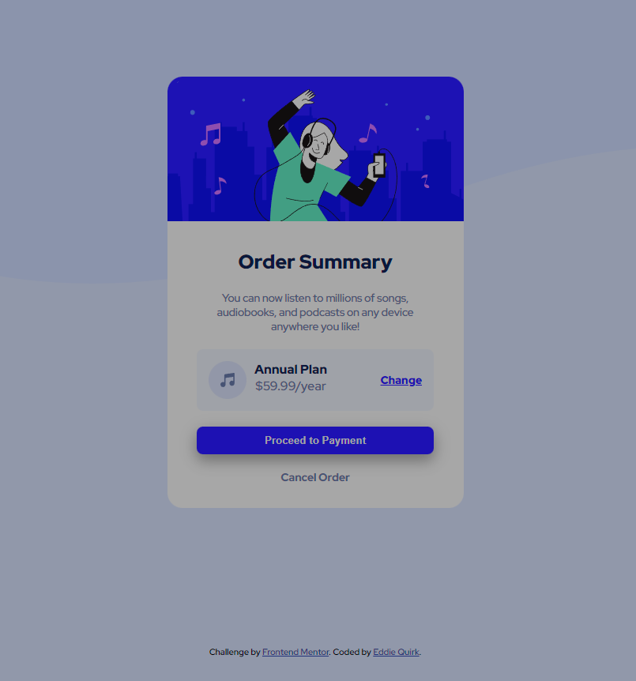

# Frontend Mentor - Order summary card solution

This is a solution to the [Order summary card challenge on Frontend Mentor](https://www.frontendmentor.io/challenges/order-summary-component-QlPmajDUj).

## Table of contents

- [Overview](#overview)
  - [The challenge](#the-challenge)
  - [Screenshot](#screenshot)
  - [Links](#links)
- [My process](#my-process)
  - [Built with](#built-with)
  - [What I learned](#what-i-learned)
  - [Continued development](#continued-development)
  - [Useful resources](#useful-resources)
- [Author](#author)
- [Acknowledgments](#acknowledgments)

## Overview

### The challenge

Users should be able to:

- See hover states for interactive elements

### Screenshot

### Links

- Solution URL: [Live Site](https://edquirk.github.io/order-summary-component-main/)
- Live Site URL: [GitHub Repository](https://github.com/edquirk/order-summary-component-main)

## My process

I used HTML and CSS.  I used Flexbox and custom properties for most colors.

### Built with

- Semantic HTML5 markup
- CSS custom properties
- Flexbox

### What I learned

I learned more about using Flexbox and custom properties, had trouble with background image but figured it out.

## Author

- Website - [Eddie Quirk](tbd)
- Frontend Mentor - [@edquirk](https://www.frontendmentor.io/profile/edquirk)
